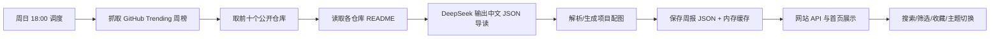

# 开源信号：GitHub 周榜中文导读

## 1. 项目目的

"开源信号"是一个公开访问的网站。它在每周日 18:00（`Asia/Shanghai`）整理 GitHub Trending 周榜前十个公开仓库，并将仓库 README 交给 DeepSeek 生成中文导读。读者先看短摘要，再按需展开完整导读，以更快判断项目是否值得深入。

首版不要求登录。内容与接口已经按"公开内容层"和"未来用户层"分开：之后可增加账号、收藏、订阅、阅读历史，而不改变周报生成和项目导读的核心流程。

## 2. 当前功能（v0.2）

### 核心功能
1. 首页自动读取最新周报，展示一个精选项目和完整前十榜单。
2. 每个项目显示本周 star 增长、累计 star、主要语言和 GitHub 跳转链接。
3. 项目导读包含一句话总结、解决的问题、核心能力、快速开始、适合人群和注意事项。
4. 服务通过 GitHub Trending 的 `weekly` 页面获取全语言公开仓库，并截取前十名。
5. README 从 GitHub 原始文件地址读取；DeepSeek 采用 OpenAI 兼容的聊天接口，要求结构化 JSON 输出。
6. 核心网络请求会自动重试。每周调度在上海时区运行；管理员也可调用受令牌保护的接口手动触发。
7. 没有配置 DeepSeek 密钥时，页面仍可展示榜单和清晰的降级说明；仓库中带有一份演示周报，首次启动可直接查看界面。
8. 项目详细卡片会优先展示 README 中的真实图片，并过滤 star、fork、构建状态等徽章图片；如果 README 没有合适图片，则使用项目功能和 DeepSeek 导读生成图像提示词，配置 OpenAI Images API 后自动生成并缓存。

### v0.2 新增功能
9. **搜索与筛选**：支持按项目名、描述、导读内容关键词搜索；支持按编程语言筛选；支持仅查看收藏项目。
10. **本地收藏**：点击 ♡ 按钮收藏感兴趣的项目，数据保存在浏览器 localStorage，支持"仅看收藏"筛选。
11. **历史周报**：顶部下拉菜单切换查看历史周报，所有周报自动归档。
12. **主题切换**：支持深色 / 浅色主题切换，跟随系统偏好，选择保存在本地。
13. **RSS 订阅**：提供 RSS 2.0 订阅源，可在 RSS 阅读器中订阅每周更新。
14. **周报导出**：支持将任意周报导出为 Markdown 文件下载。
15. **语言筛选 Trending**：后端支持按编程语言抓取 GitHub Trending（如 `/trending/javascript`）。
16. **骨架屏加载**：页面加载时显示骨架屏动画，提升感知性能。
17. **健康检查接口**：`GET /health` 返回服务状态、版本和运行时间。

## 3. 技术选型

| 范围 | 技术 | 用途 |
| --- | --- | --- |
| 服务端 | Node.js 20+ + Express | 静态页面托管、REST API、定时任务 |
| 前端 | 原生 HTML、CSS、ES Modules | 零构建、轻量单页阅读体验 |
| 定时任务 | node-cron | 每周日 18:00 按 `Asia/Shanghai` 生成周报 |
| GitHub 采集 | Fetch + Cheerio | 获取并解析 GitHub Trending weekly 页面 |
| AI 解读 | DeepSeek API | 读取 README 后输出结构化中文导读 |
| 图像生成 | 火山方舟 Seedream / OpenAI Images | 项目配图自动生成 |
| 数据存储 | JSON 文件 + 内存缓存 | 轻量本地存储，适合单实例部署 |
| 自动化测试 | Node Test Runner | 内置测试框架，零依赖（38 个测试用例） |
| 代码质量 | ESLint + Prettier | 代码规范检查与格式化 |
| 容器化 | Docker | 支持 Docker 部署 |
| CI | GitHub Actions | 自动运行测试和代码检查 |

页面采用"项目图谱"式布局：深色炭黑底色、酸性黄绿作为核心状态色、青绿色作为信息标签。它强调榜单数据与阅读层级，避免大面积渐变、空泛标语或装饰性卡片堆叠。v0.2 新增浅色主题支持。

## 4. 系统架构（v0.2）

### 后端目录结构

```
server/
├── index.js              # 应用入口，创建 Express 应用、启动定时任务
├── config.js             # 配置管理，统一环境变量、校验、默认值
├── report.js             # 周报生成逻辑
├── storage.js            # 数据存储（JSON 文件 + 内存缓存）
├── project-media.js      # 项目配图处理
├── middleware/           # Express 中间件
│   ├── errorHandler.js   # 统一错误处理 + 业务错误类
│   ├── requestLogger.js  # 请求日志（方法、路径、状态码、耗时）
│   └── auth.js           # 管理员鉴权（Bearer Token）
├── routes/               # 路由模块
│   ├── report.js         # 周报查询接口
│   ├── admin.js          # 管理接口（手动生成周报）
│   ├── project.js        # 项目导读/配图生成接口
│   └── feed.js           # RSS、导出、健康检查
├── services/             # 业务服务
│   ├── trending.js       # GitHub Trending 抓取（支持语言筛选）
│   ├── deepseek.js       # DeepSeek AI 导读
│   ├── media.js          # 图像生成与处理
│   └── retry.js          # 通用重试机制
└── utils/                # 工具函数
    ├── logger.js         # 统一日志工具（debug/info/warn/error）
    └── exporter.js       # 周报导出为 Markdown
```

### 前端目录结构

```
public/
├── index.html            # 页面结构
├── styles.css            # 样式（深色/浅色主题、响应式）
├── app.js                # 主应用逻辑
├── project-cache.js      # 项目配图缓存
└── modules/              # 前端功能模块
    ├── theme.js          # 主题切换（深色/浅色）
    ├── search.js         # 搜索与筛选
    ├── favorites.js      # 本地收藏管理
    └── history.js        # 历史周报加载
```

### 系统流程



网络请求的处理方式：Trending 抓取、README 下载、DeepSeek 调用分别有重试；单个项目的模型调用最终失败时会写入可见的降级文本，确保整周报告仍能发布。

## 5. API 接口文档

### 公开接口

| 方法 | 路径 | 说明 |
|------|------|------|
| GET | `/api/report/latest` | 获取最新周报 |
| GET | `/api/reports` | 获取所有周报列表（按时间倒序） |
| GET | `/api/report/:weekKey` | 获取指定周报（如 `/api/report/2026-08-09`） |
| GET | `/api/rss` | RSS 2.0 订阅源 |
| GET | `/api/report/:weekKey/export` | 导出周报为 Markdown 文件下载 |
| GET | `/health` | 健康检查（返回状态、版本、运行时间） |

### 管理接口（需 ADMIN_TOKEN）

| 方法 | 路径 | 说明 |
|------|------|------|
| POST | `/api/admin/run-report` | 手动触发生成周报（异步，返回 202） |
| POST | `/api/project/:owner/:name/explanation` | 为项目生成（或重新生成）中文导读 |
| POST | `/api/project/:owner/:name/media` | 为项目生成（或重新生成）配图 |

### 错误响应格式

所有 API 错误统一返回 JSON 格式：
```json
{
  "message": "错误描述信息",
  "details": {} // 可选，附加详情
}
```

HTTP 状态码：
- `400` - 请求参数错误
- `401` - 未授权（管理接口）
- `404` - 资源不存在
- `502` - 上游服务错误（AI / 图像生成失败）
- `503` - 服务暂不可用

## 6. 本地运行

### 环境要求
- Node.js >= 20.0.0
- npm >= 9.0.0

### 安装与运行

```bash
# 1. 安装依赖
npm install

# 2. 配置环境变量
cp .env.example .env
# 编辑 .env，填写 DEEPSEEK_API_KEY（可选，不填则展示降级内容）

# 3. 启动服务
npm run dev

# 4. 打开浏览器
# http://localhost:3000
```

### 常用命令

```bash
npm run dev            # 启动开发服务
npm run start          # 启动服务（同 dev）
 npm run stop           # 停止服务（Windows）
npm run restart        # 重启服务
npm test               # 运行测试
npm run test:watch     # 监听模式运行测试
npm run lint           # 代码检查
npm run lint:fix       # 自动修复代码问题
npm run format         # 代码格式化
npm run format:check   # 检查代码格式
npm run docker:build   # 构建 Docker 镜像
npm run docker:run     # 运行 Docker 容器
```

### 手动生成新周报

向 `POST /api/admin/run-report` 发请求。若设置了 `ADMIN_TOKEN`，请求头必须包含 `Authorization: Bearer <ADMIN_TOKEN>`。

```bash
curl -X POST http://localhost:3000/api/admin/run-report \
  -H "Authorization: Bearer YOUR_ADMIN_TOKEN"
```

## 7. 配置项

| 变量 | 必填 | 默认值 | 说明 |
| --- | --- | --- | --- |
| `PORT` | 否 | `3000` | 服务端口 |
| `NODE_ENV` | 否 | `development` | 运行环境（production 时启用优化） |
| `CRON_EXPRESSION` | 否 | `0 18 * * 0` | 周报生成 Cron 表达式 |
| `TIMEZONE` | 否 | `Asia/Shanghai` | 定时任务时区 |
| `DEEPSEEK_API_KEY` | 线上必填 | - | DeepSeek API 密钥 |
| `DEEPSEEK_MODEL` | 否 | `deepseek-chat` | DeepSeek 模型名称 |
| `DEEPSEEK_BASE_URL` | 否 | 官方地址 | DeepSeek API 地址（兼容 OpenAI 协议） |
| `DEEPSEEK_TEMPERATURE` | 否 | `0.35` | AI 生成温度（0-1） |
| `IMAGE_PROVIDER` | 否 | 自动检测 | 图像服务：`volcengine` / `openai` / 留空自动检测 |
| `VOLCENGINE_API_KEY` | 缺图时需要 | - | 火山方舟 API Key |
| `VOLCENGINE_IMAGE_MODEL` | 火山时必填 | - | Seedream 模型 ID 或 Endpoint ID |
| `VOLCENGINE_BASE_URL` | 否 | 官方地址 | 火山方舟 API 地址 |
| `OPENAI_API_KEY` | 缺图时需要 | - | OpenAI API Key |
| `OPENAI_IMAGE_MODEL` | 否 | `gpt-image-1` | OpenAI 图像模型 |
| `ADMIN_TOKEN` | 建议 | - | 管理接口鉴权令牌 |
| `REPORTS_DIR` | 否 | `data/reports` | 周报数据存储目录 |
| `GENERATED_DIR` | 否 | `public/generated` | 生成图片存储目录 |
| `REPORT_MAX_PROJECTS` | 否 | `10` | 每期周报最大项目数 |
| `TRENDING_SINCE` | 否 | `weekly` | Trending 时间范围（daily/weekly/monthly） |

## 8. Docker 部署

### 构建与运行

```bash
# 构建镜像
npm run docker:build

# 运行容器（挂载数据卷）
docker run -d \
  --name github-weekly-signal \
  -p 3000:3000 \
  --env-file .env \
  -v $(pwd)/data:/app/data \
  -v $(pwd)/public/generated:/app/public/generated \
  github-weekly-signal
```

### Docker 特性
- 多阶段构建，镜像体积小
- 非 root 用户运行，提升安全性
- 内置健康检查
- 支持数据持久化（周报数据和生成图片）

## 9. 测试

### 运行测试

```bash
npm test              # 运行所有测试
npm run test:watch    # 监听模式
```

### 测试覆盖范围（38 个测试用例）

| 模块 | 测试数 | 覆盖内容 |
|------|--------|----------|
| Trending 解析 | 4 | HTML 解析、排名、语言、多项目、无语言 |
| Trending URL | 5 | 语言筛选、时间范围、URL 编码 |
| DeepSeek | 1 | 请求构造、JSON 格式要求 |
| 媒体处理 | 5 | 图片提取、提示词构建、火山请求、错误处理 |
| 重试机制 | 1 | 失败重试、成功返回 |
| 项目缓存 | 1 | 状态管理、失败不重复请求 |
| 项目配图 | 1 | 按需补齐、更新记录 |
| README 读取 | 1 | 网络错误重试 |
| 配置管理 | 2 | 图像服务检测、配置校验 |
| 周报导出 | 3 | 正常导出、空项目、缺字段 |
| 搜索筛选 | 15 | 关键词搜索、语言筛选、收藏筛选、组合筛选、高亮 |
| **总计** | **38** | |

## 10. 后续升级建议

1. 将 JSON 存储换成 PostgreSQL：拆分 `reports`、`projects`、`project_explanations`、`users`、`bookmarks`、`subscriptions` 表。
2. 加入账号体系：使用独立认证服务，并将收藏、订阅、已读状态绑定到用户 ID；公开周报 API 保持不变。
3. 为周报生成建立任务队列：部署到多实例或无服务器平台后，使用持久化队列与分布式锁，避免重复生成。
4. 增加缓存与版本：保存 README 的提交 SHA、导读模型版本和生成时间，便于重跑、审查与成本控制。
5. 增加邮件或消息推送前，先加入邮箱验证、退订流程和通知偏好设置。
6. 增加项目趋势图表：展示 star 增长曲线、语言分布等可视化数据。
7. 支持多语言 Trending 同时抓取：每周生成全语言 + 各主要语言的多份周报。

## 11. 部署注意事项

当前 JSON 文件存储只适用于单实例、带持久化磁盘的部署。部署到 Vercel 等无状态平台时，应将报告存储迁移到数据库或对象存储；定时任务改由平台 Cron、GitHub Actions 或云任务服务触发，再调用一个受保护的生成接口。

生产环境建议：
- 配置 `ADMIN_TOKEN` 保护管理接口
- 配置 `NODE_ENV=production` 启用优化
- 使用反向代理（Nginx）处理 HTTPS 和静态资源缓存
- 定期备份 `data/reports/` 目录
- 监控 API 错误率和响应时间
